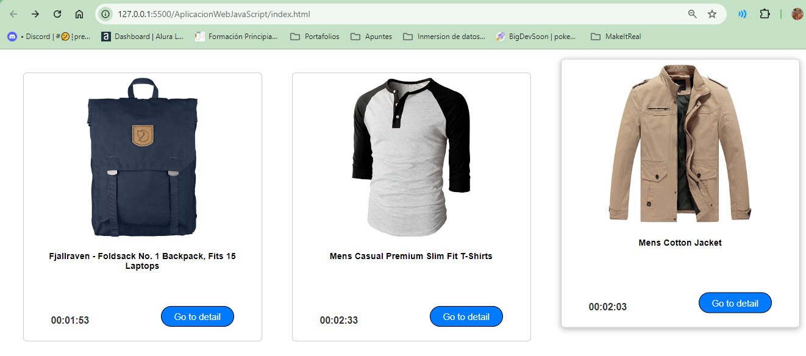

# Make It Real -

Esta es una solución al Sprint 4 Assessment 1: Aplicación Web con JavaScript Vanilla
El codigo tiene un script: timeCount.js donde setee el tiempo del contador para los 5 primeros items, los restantes es un valor random entre 60 a 180 segundos.
Se usa el api https://fakestoreapi.com/ para poder listar los titulos e imagenes de los productos asociados a un ID.
El boton "Go to detail", al dar click sale un alerta "(Click) Vas a ir al detalle del producto"
El temporizador al llegar a "00:00:00" el boton "Go to detail" lo deshabilita.

## Tabla de Contenidos

- [Resumen](#resumen)
- [El desafío](#el-desafío)
- [Pantallazo](#pantallazo)
- [Mi proceso](#mi-proceso)
- [Tecnología utilizada](#tecnología-utilizada)
- [Lo que aprendí](#lo-que-aprendí)
- [Desarrollo a futuro](#desarrollo-a-futuro)
- [Recursos útiles](#recursos-útiles)
- [Autor](#autor)
- [Agradecimientos](#agradecimientos)

## Resumen

### El desafío

Mejorar nuestras habilidades en el uso de javascript vainilla.

### Pantallazo

Se muestra el pantallazo del modo escritorio

## Mi proceso

### Tecnología utilizada

- Marcado HTML5 semántico
- Javascript Vainilla

### Lo que aprendí

Durante el desarrollo de este proyecto, aprendí a usar mejor javascript vainilla.

### Desarrollo a futuro

En futuros proyectos, me enfocaré en mejorar mis habilidades en javascript.

### Recursos útiles

## Autor

- Github - [@Mikelyto1994](https://github.com/Mikelyto1994)

## Agradecimientos

Agradezco a los instructores del curso Make It Real por proporcionar un marco tan útil para este proyecto. También quiero reconocer a la comunidad de desarrolladores en línea que ofrece valiosos recursos y apoyo.
